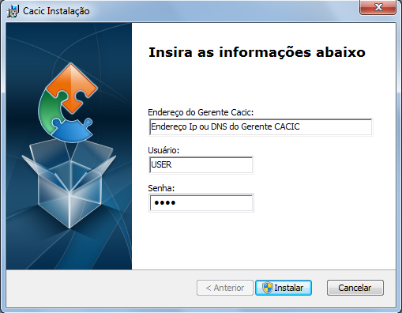

======================
Instalação dos Agentes
======================

 A instalação dos agentes nas máquinas ocorre de uma forma clara e intuitiva. Existem instaladores próprios tanto para o sistema Windows quanto para o GNU/Linux.

**Instalação em computadores Windows**

 Para instalação em ambiente Windows, basta baixar o arquivo “.msi” do repositório e execute o programa. 

.. image:: img/instalador1.png

 Quando o instalador abrir, clique em “Próximo”.

.. image:: img/instalador2.png

 Clique em “Instalar” para seguir com a instalação padrão.

 Insira o endereço IP ou o DNS onde o Gerente Cacic se encontra, o usuário e a senha. Logo após, clique em “Instalar”.

 Caso a instalação tenha sido feita de forma padrão, conforme este manual e sem alterações, o usuário e senha são respectivamente “cacic” e “cacic123”.

 Para realizar a alteração desta chave de API entre como administrador do Gerente Cacic e acesse o menu “Meus Dados” (Barra de Título e Configurações Rápidas do Sistema → Meus Dados → Meus Dados, item 7.5.2 deste manual) e clicando no botão azul “Editar Dados” será aberta uma nova página para edição dos dados.

 Altere a chave de API e outros dados, caso queira corrigir e clique em “Salvar Dados”. Será solicitado a instalação de algumas dependências, como o OpenSSL, aceite todas.

.. image:: img/instalador4.png

 Instalação realizada com sucesso.

 Instalação em computadores GNU/Linux

 Para instalação em ambiente GNU/Linux é necessário fazer o download do arquivo de instalação no repositório e executar o seguinte comando:

``Install-cacic -host=EnderecoDoGerente -user=usuário -pass=senha``
 
======================================
Verificação de Logs no sistema Windows
======================================

 Os arquivos de log no sistema Windows ficam em “C:\Cacic\Logs”.

**Arquivos de Logs:**

+ **cacic:** Este arquivo apresenta todas as atividades do Agente Cacic, como instalação, atualização e coletas.

 - **Instalação:** Quando o processo de instalação ocorre sem erros, o Agente reporta um log como este: (O conteúdo dos logs podem variar conforme a máquina, mas deve ser parecido com este)

``[13-05-2015 11:01:00.783] [Info] {Install Cacic} Inicio de instalacao``

``[13-05-2015 11:01:00.788] [Info] {Install Cacic} Realizando login...``

``[13-05-2015 11:01:02.277] [Info] {Install Cacic} Login realizado com sucesso!``

``[13-05-2015 11:01:03.524] [Info] {Install Cacic} Pegando informacoes do gerente...``

``[13-05-2015 11:01:04.275] [Info] {Install Cacic} Sucesso! Salvando configuracoes em arquivo...``

``[13-05-2015 11:01:04.285] [Info] {Install Cacic} Realizando download do servico...``

``[13-05-2015 11:01:04.306] [Info] {Install Cacic} Instalando servico.``

``[13-05-2015 11:01:04.313] [Info] {Cacic Daemon} Servico parado.``

``[13-05-2015 11:01:04.878] [Info] {Cacic Daemon} Cacic 3.1.11 iniciado.``

``[13-05-2015 11:01:05.878] [Info] {Install Cacic} Instalacao realizada com sucesso.``

 - **Coleta:** Quando o Agente realiza sua consulta, ele somente a envia para o gerente caso esta seja diferente da coleta já existente.

  - **Enviando coletas:**

``[10-05-2015 03:27:23.737] [Info] {Cacic Daemon (Thread)} Thread iniciada em: dom mai 10 03:27:23 2015``

``[10-05-2015 03:27:24.205] [Info] {Gercols} Iniciando coleta de hardware.``

``[10-05-2015 03:27:25.702] [Info] {Gercols} Coleta de hardware finalizada.``

``[10-05-2015 03:27:25.702] [Info] {Gercols} Iniciando coleta de software.``

``[10-05-2015 03:27:25.718] [Info] {Gercols} Coleta de software finalizada.``

``[10-05-2015 03:27:27.995] [Info] {Gercols} Novas informacoes prontas para o envio ao gerente.``

``[10-05-2015 03:27:28.073] [Info] {Cacic Daemon (Thread)} Thread finalizada com SUCESSO``

``[10-05-2015 03:27:28.073] [Info] {Cacic Daemon (Timer)} Enviando coleta ao gerente.``

``[10-05-2015 03:28:04.702] [Info] {Cacic Daemon (Timer)} Coleta enviada com sucesso.``

  - **Sem coletas para enviar:**

``[10-05-2015 04:25:48.206] [Info] {Cacic Daemon (Thread)} Thread iniciada em: dom mai 10 04:25:48 2015``

``[10-05-2015 04:25:48.564] [Info] {Gercols} Iniciando coleta de hardware.``

``[10-05-2015 04:25:49.906] [Info] {Gercols} Coleta de hardware finalizada.``

``[10-05-2015 04:25:49.906] [Info] {Gercols} Iniciando coleta de software.``

``[10-05-2015 04:25:49.922] [Info] {Gercols} Coleta de software finalizada.``

``[10-05-2015 04:25:51.856] [Info] {Gercols} Coleta sem alteracoes.``

``[10-05-2015 04:25:51.934] [Info] {Cacic Daemon (Thread)} Thread finalizada com SUCESSO``

``[10-05-2015 04:25:51.934] [Info] {Cacic Daemon (Timer)} Sem diferenca na coleta.``

 - **Atualização:** O Agente ao se comunicar com o Gerente, recebe informações sobre a última versão dos agentes no servidor, caso sua versão esteja desatualizada, o mesmo realizará sua atualização antes de efetuar o envio das coletas.

``[13-05-2015 11:58:33.163] [Info] {Cacic Daemon (Timer)} Realizando comunicacao em: 10.209.8.110/app_dev.php``

``[13-05-2015 11:58:37.905] [Info] {CheckModules} Atualizacao de gercols.exe necessaria.``

``[13-05-2015 11:58:37.949] [Info] {CheckModules} gercols.exe baixado com sucesso!``

``[13-05-2015 11:58:37.952] [Info] {CheckModules} Atualizacao de install-cacic.exe necessaria.``

``[13-05-2015 11:58:37.996] [Info] {CheckModules} install-cacic.exe baixado com sucesso!``

+ **cacic_error:** O Agente também informa quando algum erro ocorre. Alguns possíveis erros.

``[Error] {CheckModules} Problemas durante o download de cacic-service.exe``

``[Error] {CheckModules} O arquivo ja esta sendo usado por outro processo.``

``[Error] {CheckModules} Problemas durante o download de chksys.exe``

``[Error] {Cacic Daemon (Timer)} Problemas ao checkar modulos.``

``[Error] {CheckModules} O arquivo ja esta sendo usado por outro processo.``

``[Error] {CheckModules} Problemas durante o download de cacic-service.exe``

``[Error] {CheckModules} O arquivo ja esta sendo usado por outro processo.``

``[Error] {CheckModules} Problemas durante o download de chksys.exe``

``[Error] {Cacic Daemon (Timer)} Falha na coleta: Error downloading https://10.209.8.110/app_dev.php/ws/neo/coleta - server replied: Internal Server Error``

+ **SCRIPT_CACIC:** Quando o Agente é instalado via script, também é gerado um log.

``-----------------------------UPDATE CACIC-----------------------------``

``20/02/2015 - Conectando via Samba...``

``20/02/2015 - MSI encontrando, realizando instalação cacic 3.0...``

``20/02/2015 - Removendo conexão com a partição Samba...``

``20/02/2015 - Deletando vestigios de atualizacao...``

``20/02/2015 - Deletando pasta temporaria...``

`<-- Anterior <menus_auxiliares.rst>`_ - - - `Inicio <../index.rst>`_