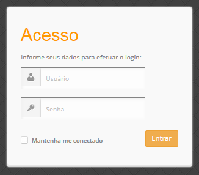

========================================
Manual do Administrador do Sistema Cacic
========================================

**Informações sobre o Sistema Cacic**

O sistema CACIC - Configurador Automático e Coletor de Informações Computacionais trabalha com o uso de software para as plataformas MS-Windows e GNU/Linux e funciona essencialmente a partir do trabalho de módulos agentes, onde utiliza como base conceitual a metodologia MaSE (Multi-agentCACIC - Configurador Automático e Coletor de informações Computacionais Software Engineering). Na plataforma MS-Windows, os agentes são programas compilados e não criam dependências ao seu funcionamento. Dessa forma, qualquer empresa/órgão que queira utilizar o CACIC não necessitará de softwares adicionais para a implantação do Sistema. 

O Cacic é capaz de fornecer um diagnósco preciso do parque computacional e disponibilizar informações como o número de equipamentos e sua distribuição nos mais diversos órgãos, os tipos de softwares utilizados e licenciados, configurações de hardware, entre outras. Também pode fornecer informações patrimoniais e a localização física dos equipamentos, ampliando o controle do parque computacional e a segurança na rede.

Requisitos para Implantação
^^^^^^^^^^^^^^^^^^^^^^^^^^^

**Requisitos Mínimos**

+----------------------------------+---------------------------------------------------------------------+
|HARDWARE                                                                                                |
+==================================+=====================================================================+
|CPU:                              |Pentium/AMD quadcore (ou superior)                                   |
+----------------------------------+---------------------------------------------------------------------+
|Memória RAM:                      |4 Gbytes                                                             |
+----------------------------------+---------------------------------------------------------------------+
|Disco rígido:                     |100 Gbytes                                                           |
+----------------------------------+---------------------------------------------------------------------+
|Interface de rede                 |                                                                     |
+----------------------------------+---------------------------------------------------------------------+

+----------------------------------+---------------------------------------------------------------------+
|SOFTWARE                                                                                                |
+=============================+==========================================================================+
|SISTEMA OPERACIONAL:         |Sistema desenvolvido para qualquer distribuição GNU/Linux;)               |
+-----------------------------+--------------------------------------------------------------------------+
|Servidor Web:                |PHP5: 5.4.13                                                              |
+-----------------------------+--------------------------------------------------------------------------+
|Servidor de banco de dados:  |PostgreSQL 9.3                                                            |
+-----------------------------+--------------------------------------------------------------------------+
|PHP:                         |- Criptografia com MCrypt (php-MCrypt)                                    |

|                             |- PHP com suporte a troca de arquivos por FTP. (php-FTP)                  |

|                             |- PHP com suporte a conexão a serviço de diretórios padrão LDAP.(php-LDAP)|

|                             |- PHP com suporte a imagens com GD (php-GD)                               |

|                             |- PHP intl                                                                |

|                             |- Biblioteca de criptografia SSL                                          |
+-----------------------------+--------------------------------------------------------------------------+
|APACHE:                      |- Memória para execução de programas PHP:--- 512MB (MINIMO)               |
+-----------------------------+--------------------------------------------------------------------------+

Para o Agente Linux são necessários o ambiente de desenvolvimento em C;

Maiores informações podem ser obtidas nos sítios dos respectivos fabricantes: `Apache <http://httpd.apache.org/>`_; `MYSQL <http://www.mysql.com/>`_; `PHP <http://www.php.net/>`_; `Source Forge <http://sourceforge.net>`_; `PROFTPD <http://www.proftpd.org/>`_

**Pré condição: É necessário estar conectado a internet, e banco de dados PostgreSQL instalado.**

Instalação Manual
=================

Este roteiro irá orientá-lo como fazer uma NOVA instalação do Gerente Cacic 3.1 em máquinas com Sistema Operacional Linux. 

A instalação ocorre basicamente por linhas de comando através do Terminal, para tanto, acesse o Painel Inicial (Launcher) que fica localizado no canto superior esquerdo de sua tela. 

Após aparecer a opção de busca digite “``Terminal``” e pressione a tecla "``Enter``". Agora seguiremos com os comandos dentro do Terminal. 

Caso não o encontre utilize as teclas de atalho “``CTRL + ALT + T``”. 

**Utilizando o Terminal**

Observação sobre o uso do terminal: 

Dentro do terminal o cursor ficará sempre depois de "``$``" ou "``#``". 

Sempre que o comando a ser copiado for precedido por "``$``", significa que este é um comando de usuário normal; 

Sempre que o comando a ser copiado for precedido por "``#``", significa que este é um comando de usuário “``root``”. 

Caso o comando a ser copiado não seja precedido por "``$``" nem por "``#``", significa que este comando pode ser executado sem restrições. 

Para acessar como “``root``” digite "``sudo su``". 

Foi utilizado para este tutorial o “Terminal” em idioma inglês, então as confirmações apresentadas aqui estão em (Yes/Y ou No/N), caso seu sistema esteja em português confirme com (Sim/S ou Não/N). 

Siga a instalação passo a passo. Caso algum procedimento venha a falhar, não desconsidere pois pode ocasionar outros erros. Corrija-os antes de prosseguir com a instalação.

Instalação em CentOS 6
^^^^^^^^^^^^^^^^^^^^^^

**Preparação inicial.**

+ Instale o software de suporte:

.. code-block:: bash
 
 cd /tmp

 yum install wget java-1.8.0-openjdk

+ Configure mirror da globo.com para software SCL                                                    

.. code-block:: bash

 echo "
 
 [SCL]
 
 name=CentOS-\$releasever - SCL
 
 baseurl=http://mirror.globo.com/centos/6/SCL/\$basearch/
 
 gpgcheck=1
 
 Priority=1
 
 enabled=1                               
 
 gpgkey=http://mirror.globo.com/centos/RPM-GPG-KEY-CentOS-Testing-6" >
 
 /etc/yum.repos.d/CentOS-SCL-globo.repo                             
 
 rpm --import http://mirror.globo.com/centos/RPM-GPG-KEY-CentOS-Testing-6                     

+ PHP                                                                                                  

.. code-block:: bash

 yum install php54 php54-php php54-php-xml php54-php-pdo php54-php-gd php54-php-mcrypt  php54-php-pgsql php54-php-intl php54-php-pecl-apc

+ Habilite nova versão do PHP                                                                           

.. code-block:: bash

 scl enable php54 "php -v"
 
 source /opt/rh/php54/enable
 
 rm /etc/httpd/conf.d/php.conf
 
 /usr/sbin/apachectl -t
 
 /etc/init.d/httpd restart

+ Instale o  mcrypt

.. code-block:: bash

 cd /tmp
 wget https://www.softwarecollections.org/repos/remi/php54more/epel-6-x86_64/php54-php-mcrypt-5.4.16-3.el6.x86_64.rpm

+ Corrija o fuso horário do php:

.. code-block:: bash

 vi /opt/rh/php54/root/etc/php.ini
 
 date.timezone = America/Sao_Paulo
 
 Ajustes de parâmetros
 
 max_execution_time = 300
 
 memory_limit = 512M

+ Baixe o Código do Gerente

.. code-block:: bash

 cd /srv
 
 wget https://github.com/lightbase/cacic/archive/v3.1.14.tar.gz
 
 tar -xzvf v3.1.14.tar.gz
 
 ln -s cacic-3.1.14 cacic

**Obs.:** Para escolher outra release acesse a página do Cacic e veja a última disponível: `Releases Cacic <https://github.com/lightbase/cacic/releases>`_
 
Configuração inicial
====================

**Configure o Apache para responder na raiz.**

+ Abra o arquivo /etc/httpd/conf/httpd.conf e altere as seguintes linhas:

.. code-block:: bash

 #DocumentRoot "/var/www/html"
 
 DocumentRoot "/srv/cacic/web"

----

.. code-block:: bash

 #<Directory "/var/www/html">
 
 <Directory "/srv/cacic/web">
 
 #
 
 # Possible values for the Options directive are "None", "All",
 
 # or any combination of:
 
 #   Indexes Includes FollowSymLinks SymLinksifOwnerMatch ExecCGI MultiViews
 
 #
 
 # Note that "MultiViews" must be named *explicitly* --- "Options All"
 
 # doesn't give it to you.
 
 #
 
 # The Options directive is both complicated and important.  Please see
 
 # http://httpd.apache.org/docs/2.2/mod/core.html#options
 
 # for more information.
 
 #
 
 Options -Indexes FollowSymLinks
 
 #
 
 # AllowOverride controls what directives may be placed in .htaccess files.
 
 # It can be "All", "None", or any combination of the keywords:
 
 #   Options FileInfo AuthConfig Limit
 
 #
 
 AllowOverride All
 
 #
 
 # Controls who can get stuff from this server.
 
 #
 
 Order allow,deny
 
 Allow from all
 
 </Directory>

----

+ Desabilite o SELinux:

.. code-block:: bash

 setenforce Permissive

+ Salve a alteração abrindo o arquivo /etc/selinux/config:

.. code-block:: bash

 SELINUX=disabled

----

+ Adicione as seguintes linhas no arquito /etc/sysconfig/iptables:

.. code-block:: bash

 # Firewall configuration written by system-config-firewall
 
 # Manual customization of this file is not recommended.
 
 *filter
 
 :INPUT ACCEPT [0:0]
 
 :FORWARD ACCEPT [0:0]
 
 :OUTPUT ACCEPT [0:0]
 
 -A INPUT -m state --state ESTABLISHED,RELATED -j ACCEPT
 
 -A INPUT -p icmp -j ACCEPT
 
 -A INPUT -i lo -j ACCEPT
 
 # SSH somente nas redes autorizadas
 
 -A INPUT -s 10.209.57.0/24 -m state --state NEW -m tcp -p tcp --dport 22 -j ACCEPT
 
 -A INPUT -s 10.209.156.0/24 -m state --state NEW -m tcp -p tcp --dport 22 -j ACCEPT
 
 # Portas HTTP e HTTPS
 
 -A INPUT -p tcp -m tcp --dport 80 -j ACCEPT
 
 -A INPUT -p tcp -m tcp --dport 443 -j ACCEPT
 
 # Samba
 
 -A INPUT -m state --state NEW -m tcp -p tcp --dport 445 -j ACCEPT
 
 -A INPUT -m state --state NEW -m udp -p udp --dport 445 -j ACCEPT
 
 -A INPUT -m state --state NEW -m tcp -p tcp --dport 139 -j ACCEPT
 
 -A INPUT -m state --state NEW -m udp -p udp --dport 139 -j ACCEPT
 
 # Libera FTP
 
 -A INPUT  -p tcp -m tcp --dport 21 -j ACCEPT -m comment --comment "Allow ftp connections on port 21"
 
 -A OUTPUT -p tcp -m tcp --dport 21 -j ACCEPT -m comment --comment "Allow ftp connections on port 21"
 
 -A INPUT  -p tcp -m tcp --dport 20 -j ACCEPT -m comment --comment "Allow ftp connections on port 20"
 
 -A OUTPUT -p tcp -m tcp --dport 20 -j ACCEPT -m comment --comment "Allow ftp connections on port 20"
 
 -A INPUT  -p tcp -m tcp --sport 1024: --dport 1024: -j ACCEPT -m comment --comment "Allow passive inbound connections"
 
 -A OUTPUT -p tcp -m tcp --sport 1024: --dport 1024: -j ACCEPT -m comment --comment "Allow passive inbound connections"
 
 # Libera saída nas portas 80 e 443
 
 -A OUTPUT -p tcp -m tcp --dport 80 -j ACCEPT
 
 -A OUTPUT -p tcp -m tcp --dport 443 -j ACCEPT
 
 # Liera saída para o PostgreSQL
 
 -A OUTPUT -p tcp -m tcp --dport 5432 -j ACCEPT
 
 -A OUTPUT -p tcp -m tcp --dport 9999 -j ACCEPT
 
 # Bloqueia saída nas portas SMTP
 
 -A OUTPUT -p tcp -m tcp --dport 25 -j DROP
 
 -A OUTPUT -p tcp -m tcp --dport 587 -j DROP
 
 # Bloqueia o resto
 
 -A INPUT -j REJECT --reject-with icmp-host-prohibited
 
 # Bloqueia o Forward
 
 -A FORWARD -j REJECT --reject-with icmp-host-prohibited
 
 COMMIT

----

+ Carregue alterações no iptables:

.. code-block:: bash

 service iptables restart

Configurações do Symfony
========================

Como pré-requisito já deve haver um banco de dados PostgreSQL configurado para o Cacic.

+ Carregue as configurações iniciais:

.. code-block:: bash

 cp /srv/cacic/app/config/cacic-dist-parameters.yml /srv/cacic/app/config/parameters.yml

----

+ Altere as configurações no arquivo ``/srv/cacic/app/config/parameters.yml`` 

.. code-block:: bash

 parameters:
    database_driver: pdo_pgsql

    database_host: 10.209.8.151

    database_port: null

    database_name: cacic

    database_user: cacic

    database_password: null

    mailer_transport: smtp

    mailer_host: 127.0.0.1

    mailer_user: null

    mailer_password: null

    locale: pt_BR

    #locale: en_US

    # generate your own site secret

    #secret: e410b10b0cdc810ea6bb943caa542bb42b3

    database_path: null
 
Altere o campo secret com um valor gerado no seguinte endereço: http://nux.net/secret 

Instalando o Symfony
====================

+ Baixe e instale os vendors:

.. code-block:: bash

 cd /srv/cacic
 
 php composer.phar install

+ Instale o Symfony para o Cacic:

.. code-block:: bash

 cd /srv/cacic
 
 php app/console assets:install --symlink
 
 php app/console assetic:dump --env=prod
 
 php app/console assetic:dump --env=dev
 
 php app/console doctrine:schema:update --force
 
 php app/console doctrine:migrations:migrate

+ Corrija as permissões:

.. code-block:: bash

 cd /srv/cacic
 
 chown -R apache.apache

**Terminada a instalação e configuração do Gerente Cacic 3.1, execute o navegador.**

----

Instalação em Debian / Ubuntu
^^^^^^^^^^^^^^^^^^^^^^^^^^^^^

Instalando os Pacotes necessários:
==================================

**Instale os pacotes que você vai precisar:**

.. code-block:: bash
 
 apt-get -y install git postgresql apache2 php5 php5-pgsql php5-gd php5-mcrypt libapache2-mod-php5 php5-ldap php-pear php-apc subversion git openjdk-7-jre php5-intl

**Configurando o PostgreSQL:**

O arquivo "php.ini" vem com fuso horário da Europa, logo precisamos configurá-lo para o Brasil.
 
+ Abra o arquivo "php.ini" através do comando abaixo:

.. code-block:: bash

 nano /etc/php5/apache2/php.ini

Quando o arquivo abrir digite "``CTRL + W``" para abrir a ferramenta de busca e digite "``Module Settings``" 

Você verá o comando abaixo:
 
.. code-block:: bash

 [Date]
 
 ; Defines the default timezone used by the date functions
 
 ; http://php.net/date.timezone

+ Na linha imediata abaixo digite:

.. code-block:: bash
 
 date.timezone = America/Sao_Paulo

Em alguns casos, pode ser que já tenha na linha ``";date.timezone ="``, neste caso complete com “America/Sao_Paulo”.

**Não esqueça de remover o “ponto e vírgula”**

**Caso já esteja atualizado, continue.**

----

Digite "``CTRL + X``" para salvar,

Confirme a alteração com "Y + Enter"

Como "root" reinicie o Apache.

.. code-block:: bash
 
 # /etc/init.d/apache2 restart

Montando ambiente de desenvolvimento 
====================================

+ Clone o arquivo dentro de localhost:

.. code-block:: bash

 # cd /srv
 
 # git clone https://github.com/lightbase/cacic
 
 # chown -R www-data.www-data cacic

+ Crie um link simbólico da sua pasta web para o Apache:

.. code-block:: bash

 # ln -s /srv/cacic/web /var/www/cacic

A versão do apache2 que foi publicado com o lançamento do Ubuntu 14.04 é o 2.4.7 e começando com esta versão, por razões de segurança, o novo diretório raiz para o servidor é:
 
.. code-block:: bash

 /var/www/html

A partir de agora, é aqui que você deve lincar o CACIC.
 
.. code-block:: bash

 # ln -s /srv/cacic/web /var/www/html/cacic

Caso você queira mudar este diretório, você tem que modificar (como root) a seguinte linha do arquivo /etc/apache2/sites-available/000-default.conf (sudo nano /etc/apache2/sites- available/000-default.conf): 

.. code-block:: bash

 DocumentRoot /var/www/html

Para:
 
.. code-block:: bash

 DocumentRoot /var/www

+ Para entrar em vigor as novas mudanças, você deve reiniciar o servidor apache com o seguinte comando:

.. code-block:: bash

 # sudo /etc/init.d/apache2 restart

Crie banco de dados para o Symfony - PostgreSQL 
===============================================

 (É possível que já exista o banco de dados criado, caso isso ocorra passe para o próximo item). 

Execute os seguintes comandos no terminal:
 
.. code-block:: bash

 $ sudo su
 
 # su - postgres
 
 $ createuser cacic

+ Responda tudo "n", conforme abaixo:

.. code-block:: bash

 Shall the new role be a superuser? (y/n) n
 
 Shall the new role be allowed to create databases? (y/n) n
 
 Shall the new role be allowed to create more new roles? (y/n) n

+ Digite a linha abaixo:

.. code-block:: bash

 $ createdb -O cacic cacic
 
Liberando acesso ao banco de dados
==================================

.. code-block:: bash
 
 # nano /etc/postgresql/9.3/main/pg_hba.conf``

+ Procure as linhas abaixo. (estão logo no início do texto)

.. code-block:: bash

 # PostgreSQL Client Authentication Configuration File
 
 # ===================================================
 
 #
 
 # Refer to the "Client Authentication" section in the PostgreSQL
 
 # documentation for a complete description of this file. A short
 
 # synopsis follows.
 
 #
 
 # This file controls: which hosts are allowed to connect, how clients
 
 # are authenticated, which PostgreSQL user names they can use, which
 
 # databases they can access. Records take one of these forms:
 
 #
 
 # local DATABASE USER METHOD [OPTIONS]
 
 # host DATABASE USER ADDRESS METHOD [OPTIONS]
 
 # hostssl DATABASE USER ADDRESS METHOD [OPTIONS]
 
 # hostnossl DATABASE USER ADDRESS METHOD [OPTIONS]

+ Agora, acrescente as próximas linhas. Sem o “#”:

.. code-block:: bash

 host cacic cacic 127.0.0.1/32 trust
 
 host cacic cacic localhost trust

Digite "CTRL + X" para sair, confirme com "y" e "enter".

+ Reinicie o banco de dados:

.. code-block:: bash

 $ /etc/init.d/postgresql restart

Testando a conexão com o banco de dados:
======================================

+ Execute a linha a baixo e verifique se a mesma se encontra igual ao exemplo: 

 "exit" para sair de “root” 
 
.. code-block:: bash

 $ psql -U cacic -h localhost cacic
 
 psql (9.1.9)
 
 SSL connection (cipher: DHE-RSA-AES256-SHA, bits: 256)
 
 Type "help" for help.
 
 cacic=>

+ Digite "\q", depois "exit"

.. code-block:: bash

 $ exit

Configurando o arquivo parameters.yml
=====================================

+ Abra o arquivo "parameters.yml" conforme o comando abaixo:

.. code-block:: bash

 # nano /srv/cacic/app/config/parameters.yml

+ Adicione as seguintes linhas: (este arquivo conterá somente essas linhas) 

.. code-block:: bash

 parameters:
  
      database_driver: pdo_pgsql
  
      database_host: IP_BancoDeDados
  
      database_port: null
  
      database_name: cacic
  
      database_user: cacic
  
      database_password: null
  
      mailer_transport: smtp
  
      mailer_host: 127.0.0.1
  
      mailer_user: null
  
      mailer_password: null
  
      locale: pt_BR
  
      secret: d7c123f25645010985ca27c1015bc76797
 
      database_path: null

É necessário seguir um padrão de identação para que não ocorra erros na instalação do composer.phar. 

**Note que as linhas do arquivo parameters.yml possuem uma tabulação de 4 espaços que deverá ser preservada.** 

 Digite "CTRL+X" para fechar 

Confirme com "Y + Enter" 

Executando comandos do Symfony 
==============================

 Execute os comandos do Symfony necessários para o sistema funcionar:
 
.. code-block:: bash

 # su - www-data
 
 $ bash
 
 $ cd /srv/cacic

Caso apareça a mensagem: “*This Accont is currently not available.*” 

+ Acesso o arquivo passwd (digite nano /etc/passwd) 

Altere a seguinte linha linha: 
 
.. code-block:: bash

 www-data:x:33:33:www-data:/var/www:/usr/sbin/nologin

para:
 
.. code-block:: bash

 www-data:x:33:33:www-data:/var/www:/bin/bash

+ Instale dos vendors:

.. code-block:: bash

 $ php composer.phar install

Aguarde o fim da instalação (este processo pode levar alguns minutos)

 + Carregando os assets: (necessário haver o "java" instalado). 

 Ainda com o usuário www-data execute:
 
.. code-block:: bash

 $ php app/console doctrine:schema:update --force
 
 $ php app/console assets:install --symlink
 
 $ php app/console assetic:dump

Carregando dados iniciais 
=========================

.. code-block:: bash

 # php app/console doctrine:fixtures:load

+ Digite o comando "exit" e depois digite o mesmo comando "exit" novamente. 

 Caso apareça a mensagem:

“Could not open input file: app/console”

 Finalize o terminal com "exit" 

**Terminada a instalação e configuração do Gerente Cacic 3.0, execute o navegador.**

----

Configurando o FTP (Opcional)
^^^^^^^^^^^^^^^^^^^^^^^^^^^^^

+ Abra o navegador e digite: 

`http://localhost/cacic/ <http://localhost/cacic/>`_

 Pressione "enter". 

+ Clique em app_dev.php 

 Entre com o usuário e a senha. 

Usuário: admin 

Senha: 123456

**Instalando e configurando o FTP (Debian)**

**Atenção:**

+ A instalação do FTP é OPCIONAL. Continue este passo da instalação conforme sua necessidade.

----

 Para que os Agentes consigam coletar, é necessário instalar e configurar um serviço de FTP. O procedimento abaixo deve ser executado como usuário root: 
 
.. code-block:: bash

 # apt-get install proftpd-basic

 Quando perguntado, selecione o modo autônomo (standalone) para o servidor de FTP. Em seguida, abra o arquivo de configurações:
 
.. code-block:: bash

 # vim /etc/proftpd/proftpd.conf

+ Descomente as linhas abaixo:

.. code-block:: bash
 
 # Use this to jail all users in their homes
 
 DefaultRoot                           ~
 
 # Users require a valid shell listed in /etc/shells to login.
 
 # Use this directive to release that constrain.
 
 RequireValidShell                    off
 
A versão do apache2 que foi publicado com o lançamento do Ubuntu 14.04 é o 2.4.7 e começando com esta versão, parece que, por razões de segurança, o novo diretório raiz para o servidor é:
 
.. code-block:: bash
 
 /var/www/html

Adicione um usuário que será usado pelo CACIC para download dos updates. No exemplo a seguir, adicionamos uma conta ftpcacic:
 
.. code-block:: bash

 # adduser --shell /bin/false --home /var/www/html/ftpcacic ftpcacic

Preencha a senha do usuário quando perguntado.
 
Observe que o HOME deste usuário é: ``/var/www/html/ftpcacic``

 Nesse mesmo diretório crie uma pasta “agentes” utilizando os comandos a seguir:
 
.. code-block:: bash

 # mkdir /var/www/html/ftpcacic/agentes
 
 # chown ftpcacic.ftpcacic /var/www/html/ftpcacic/agentes

+ Teste a conexão. 

 Primeiro você deverá reiniciar o proftpd com o comando a seguir:
 
.. code-block:: bash

 # /etc/init.d/proftpd restart

**Execute depois os comandos a seguir para testar a conexão FTP:**

+ Windows: 

``C:\ftp ip_do_servidor_cacic``

login: ftpcacic

senha: senha_do_ftpcacic

ftp quit

+ Linux:

``$ telnet ip_do_servidor_cacic 21``

 Quando abrir a tela do telnet, digite os seguintes comandos:

user ftpcacic

pass senha_ftp

quit

**O FTP deve estar funcionando e conectando.**