==================================
Manual do Usuário do Sistema Cacic
==================================

Configuração Inicial
====================

 Para que o sistema efetivamente comece funcionar, é preciso que seja realizada a primeira coleta, para isso é necessário cadastrar pelo menos uma Sub-rede e habilitar os módulos de coleta.

----

**Cadastro de Sub-redes**

 Cada registro de sub-rede contém detalhes específicos que determinam a abrangência, servidores de aplicação e atualização de versões e informam sobre as coletas associadas.

+ Acesse o Menu Administração → Cadastros → Sub-redes 

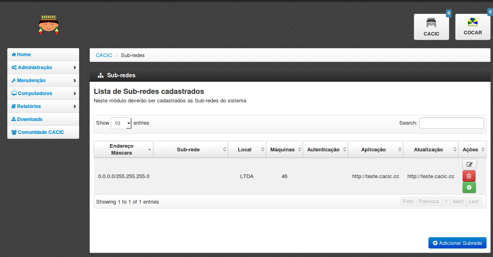

 Clique em “Adicionar Subrede” preencha os dados e clique em “Salvar Dados”.

----

**Habilitando módulos**

 Possibilita a configuração dos vários módulos do CACIC.

+ Acesse o Menu Administração → Configurar Coletas → Configurar Módulos. 

 Selecione o módulo que deseja habilitar. 

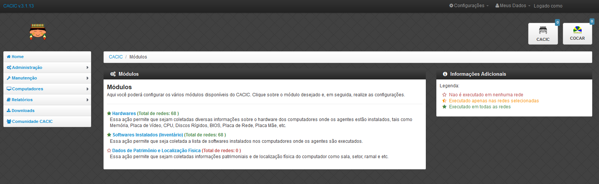

 Marque as sub-redes e em seguida clique em “Salvar Dados”. 

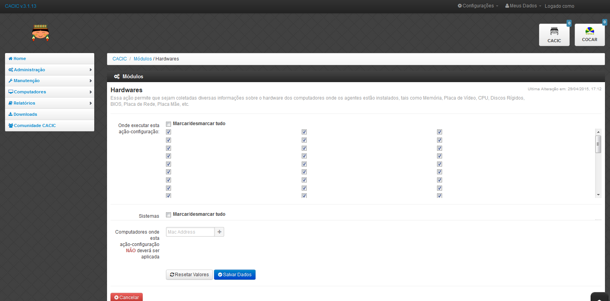

 Com isso, o sistema está pronto para realizar as coletas.

----

**Atualizando Sub-redes**

+ Acesse o Menu Administração → Configurar Coletas → Atualização de Sub-redes

Mais ao final da página vá até Sub-redes Cadastradas conforme exemplo abaixo.

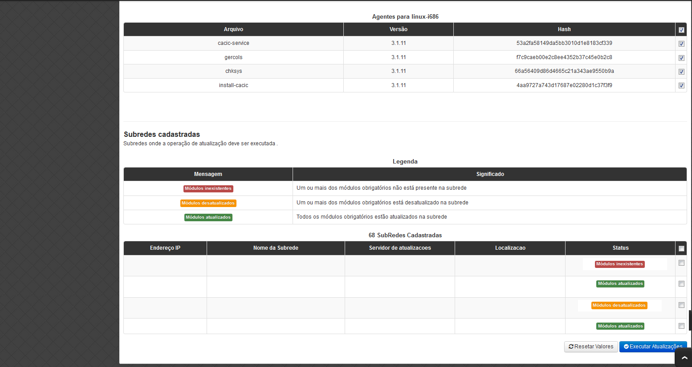

Selecione a(s) sub-rede(s) que deseja atualizar e logo em seguida clique em “Executar Atualizações”. 

Conhecendo as funcionalidades e menus do Cacic
==============================================

**A tela principal do Cacic 3.1**

 A tela principal do Cacic (home), é composta por elementos dinâmicos que facilitam a visualização das atividades mais importantes para o gerenciamento do parque computacional. Sua estrutura se divide da seguinte forma: Menu Principal; Barra de título e configurações rápidas do sistema; Barra de atalho para o Cacic e para o Software Cocar; Estatísticas do Sistema; Atalhos; Mensagem de boas vindas ao usuário; Relatório simplificado de Computadores monitorados por sistema operacional. Detalharemos toda estrutura abaixo.

**Menu Principal.**

 Os menus do software Cacic são organizados tendo como base os perfis de grupos de usuários.

+ **Grupo de usuários “Administradores”:** São os usuários previamente definidos que possuem acesso irrestrito ao sistema.

+ **Grupo de usuários “Gestores”:** Possuem acesso de leitura em todas as opções. Manutenção de tabelas e acesso a todas as informações referentes à Localização. 

+ **Grupo de usuários “Técnicos”:** Acesso técnico. Será permitido acessar configurações de rede e relatórios de Patrimônio e Hardware. Administração:

**Estrutura do Menu Principal**

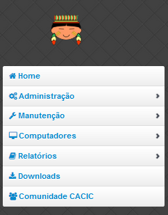

O Menu principal do Gerente Cacic é disposto com a seguinte estrutura hierárquica:

.. code-block:: html

	ADMINISTRAÇÃO
		Configurar Coletas	
			Upload de Agentes	
			Deploy de Software		
			Atualização de Subredes		
			Configurar Módulos		
			Ativar / Desativar Hardwares		
			Ativar / Desativar Softwares		
			Classes WMI		
		Logs	
			Acessos		
			Atividades		
			Insucessos Instalação		
		Cadastros	
			Locais		
			Servidores de Autenticação		
			Sub-redes		
			Computadores e Subredes		
		Usuários	
			Cadastro de Usuários		
			Grupo de Usuários		
		Patrimônio	
			Unidades Organizacionais		
			Tipos de Unidades Organizacionais		
		Forçar Coletas	
			Forçar Coletas Computadores		
			Forçar Coletas Subredes		
		Versões Agentes

	MANUTENÇÃO
		Cadastros	
			Tipos de SO		
			Sistemas Operacionais		
			Aplicativos Monitorados		
			Dispositivos USB		
			Dispositivos 3G			
		Classificar Softwares	
			Tipos de Softwares		
			Selecionar Tipo		
				Em Grupo			
				Um por um			
		Controle de Licenças	
			Tipo de Licenças		
			Processo de Aquisição		
			Softwares Adquiridos		
			Softwares por Estação		
		Localização

	COMPUTADORES
		Navegar	
		Consultar	
		Busca Avançada

	RELATÓRIOS
		Softwares	
			Relatório de Software		
			Cadastro de Relatórios		
			Softwares Inventariados		
			Controle de Licenças		
			Licenças Inativas		
			Tipo de Software		
			Software Desativados		
		Computadores	
			Faturamento		
			Total de Computadores		
			Relatório para Ateste		
			Computadores Inativos		
			Sistemas Operacionais		
			Usuário Logado		
		Hardware	
			Classes WMI		
				NetworkAdapterConfiguration			
				OperationSystem			
				Patrimônio			
				Win32_BaseBoard			
				Win32_BIOS			
				Win32_ComputerSystem			
				Win32_DesktopMonitor			
				Win32_DiskDrive			
				Win32_Keyboard			
				Win32_MemoryDevice			
				Win32_PhysicalMedia			
				Win32_PhysicalMemory			
				Win32_PointingDevice			
				Win32_Printer			
				Win32_Processor			
			WMI sem Coleta		
			WMI Dinâmico		
			Remoções

	DOWNLOADS

	COMUNIDADE CACIC

**Administração:**

**Configurar Coletas:** Menu com configurações básicas para executar coletas dos agentes.

+ **Upload de Agentes:** Ferramenta para envio ao servidor de novos binários dos Agentes. Selecione os arquivos referentes à versão do sistema e clique em “Enviar Dados”. Os arquivos devem estar em formato “.zip” ou “.tar.gz”.

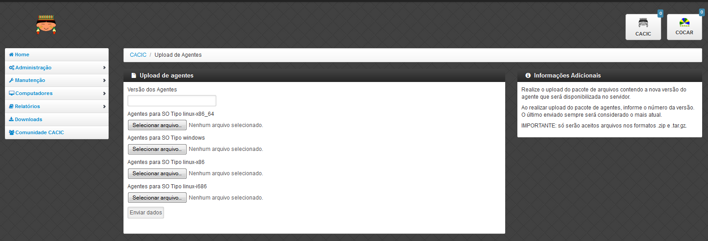

+ **Deploy de Software:** Ferramenta para envio de binários diversos ao sistema. Estes binários não necessariamente são do Cacic. Basta selecionar o arquivo desejado e clicar em “Enviar Dados”.

+ **Atualização de Subrede:** Ferramenta para controle dos binários nas diversas redes da organização. Através deste menu, é possível verificar se alguma sub-rede possui seu binário desatualizado ou inexistente. Para o uso, selecione as redes que pretende atualizar e clique em “Executar Atualização”.

+ **Configurar Módulos:** O Software Cacic permite que as modificações sejam feitas de forma controlada, selecionando em quais redes os binários devem agir. Para o uso, primeiramente, selecione qual o módulo pretende atualizar, logo após, informe em qual(is) subrede(s) será atualizado e clique em “Salvar Dados” para confirmar sua atualização. Mostrado no item “Habilitando módulos”

+ **Ativar / Desativar Hardwares:**

+ **Ativar / Desativar Softwares:**	

+ **Classes WMI:**

**Logs:** Ferramenta do sistema que disponibiliza diversas informações sobre o comportamento e atividades do sistema.

+ **Acessos:** O Log de Acesso informa os usuários que tiveram acesso ao sistema em determinado período. Para visualizar o log primeiramente escolha o período inicial e final e o local (os usuários podem ser criados com locais primários) e clique em “Filtrar”, na tela seguinte será apresentado o relatório solicitado.

+ **Atividades:** O Log de Atividades informa quais atividades foram realizadas no sistema em determinado período. Para visualizar o log primeiramente escolha o período inicial e final e o local (os usuários podem ser criados com locais primários) e clique em “Filtrar”. Na tela seguinte será apresentado o relatório solicitado.

+ **Insucessos Instalação:** Este log informa as instalações dos agentes que não foram realizadas com sucesso. Para sua visualização, simplesmente escolha o período e clique em “Filtrar”.

**Cadastros:** Ferramenta do sistema para inserção e edição de novos itens.

+ **Locais:** O sistema Cacic se baseia na localização física em que o componente se encontra. Para isso, se faz necessário inicialmente, o cadastro do local onde este computador se encontra e depois as sub-redes que este local possui. Ao navegar pelo menu e clicar em “Locais”, será apresentada uma tela com os locais já cadastrados, caso já exista algum. Para adicionar um novo local, clique em “Adicionar Local”. Na tela seguinte serão apresentadas três abas onde somente a primeira deve ser preenchida (Dados do local). Coloque o nome e a sigla do novo local e caso seja necessário, uma observação e após clique em “Salvar Dados”.

+ **Servidores de Autenticação:** Neste módulo deverão ser cadastrados todos os servidores de autenticação para uso nas aberturas de sessões de suporte remoto seguro. Ao navegar pelo menu e clicar em “Servidores Autenticação”, será apresentada uma tela com os servidores já cadastrados, caso já exista algum. Para adicionar um novo, clique em “Adicionar Servidor”. Na tela seguinte serão apresentadas quatro abas. Preencha os dados necessários nas abas e na última selecione em quais redes este servidor estará ativo. Ao finalizar clique em “Salvar Dados”.

+ **Sub-redes:** Para o software Cacic, os locais possuem suas sub-redes. Após o cadastro anterior dos locais, este módulo cadastra as sub-redes deste local. Ao navegar pelo menu e clicar em “Sub-Redes”, será apresentada uma tela com as sub-redes já cadastradas, caso já exista alguma. Para adicionar uma nova sub-rede, clique em “Adicionar Subrede”. Na tela que se abre, preencha os campos com os dados relativos a nova sub-rede. O local é um dos já criados anteriormente (caso não tenha nenhum local criado, faça fazer em “Cadastros → Locais”) Em servido de autenticação, escolha um previamente cadastrado (caso não tenha nenhum servidor cadastrado, faça em “Cadastros → Servidores Autenticação”). Em “Subrede”, informe o endereço IP da rede que deseja cadastrar e informe logo após a máscara de rede. Informe o endereço da aplicação, do servidor de upload dos Agentes e método de download (FTP ou HTTP). Caso o upload dos Agentes seja realizado pelo método FTP, informe usuário e senha para acesso. Selecione ao final da página se todos os módulos estarão habilitados para esta rede e clique em “Salvar Dados”.

+ **Computadores e Subredes:** Este módulo agrupa todas as máquinas que por alguma razão tiveram sua sub-rede identificada de forma diferente da prevista. Caso uma determinada máquina esteja em uma sub-rede “X” mas apresente um endereço IP diferente da rede, esta máquina será apresentada neste módulo, onde é possível realizar manualmente, a correta alocação da mesma. Ao navegar pelo menu e clicar em “Computadores e Subredes”, será apresentada uma tela com todas as máquinas com divergência de sub-rede, caso exista alguma. Para realizar a alocação das mesmas, selecione as máquinas desejadas e clique em “Executar Atualização”.

**Usuário:** Este módulo é o responsável pelo cadastro das pessoas que utilização o Sistema Cacic. Aqui é possível realizar o cadastro de um usuário individual ou de um grupo de usuários com acessos diferenciados.

+ **Cadastro de Usuários:** Neste módulo é possível visualizar um usuário já cadastrado no sistema, editá-lo e também cadastrar um novo. Ao navegar pelo menu e clicar em “Cadastro de Usuários”, será apresentada uma tela com os usuários já cadastrados, caso já exista algum. Para adicionar um novo usuário, clique em “Adicionar Usuário”. Na tela seguinte, preencha os campos com os dados sobre o usuário que deseja cadastrar e clique em “Salvar Dados”.

+ **Cadastro de Grupos de Usuários:** Módulo para cadastro de grupo de usuários com permissões de acesso diferenciadas. Neste módulo é possível visualizar um grupo já cadastrado no sistema, editá-lo e também cadastrar um novo. Ao navegar pelo menu e clicar em “Grupo de Usuários”, será apresentada uma tela com os grupos já cadastrados, caso já exista algum. Para adicionar um novo grupo, clique em “Adicionar Grupo de Usuários”. Na tela seguinte, preencha os campos com os dados sobre o grupo que deseja cadastrar e clique em “Salvar Dados”.

**Patrimônio:** Controles para Patrimônio.

+ **Unidades Organizacionais:** Neste módulo deverão ser cadastradas todas as unidades organizacionais do sistema - Entidades, Linhas de negócio e Órgãos. 

+ **Tipos de Unidade Organizacional:** Neste módulo deverão ser cadastrados os tipos de Unidades Organizacionais 

**Forçar Coletas:** Os Agentes Cacic realizam nas máquinas na qual estão instalados em períodos programados no Gerente. Estes agentes verificam todos os itens de hardware e software na máquina é enviam para o Gerente. Caso o resultado da coleta atual seja diferente da anterior, os dados são enviados, caso contrário, não. A função “Forçar Coletas” permite informar aos agentes que enviem as informações ao gerente mesmo que as mesmas sejam iguais à coleta anterior. Esta ação não ocorre instantaneamente ao ser solicitada, mas agenda para que na próxima coleta, os dados sejam enviados indiferente de serem iguais ou não.

+ **Forçar coleta computador:** Permite que se escolha uma máquina, através de seu endereço IP, MAC Adress ou nome de registro e depois se solicite a coleta forçada. Para sua execução, selecione uma forma de pesquisa, informe o dado  e clique em “Buscar”, após isso será gerado o resultado da busca com a(s) máquina(s) escolhidas, clique em “Coletar” para finalizar.

+ **Forçar coleta subrede:** Esta opção permite escolher uma ou diversas sub-redes para forçar a coleta. Para sua execução, selecione qual(is) rede(s) devem ser forçadas e clique em “Forçar Coleta”.

**Versões Agentes:** Este módulo exibe as versões dos agentes que estão comunicando com o Gerente. É mostrado como período, o histórico total e últimos 30 dias.

----

**Manutenção:**

**Cadastros:** Controle de módulos relativos à Sistemas Operacionais e dispositivos.

+ **Tipos de SO:** Módulo para cadastro e edição dos tipos de sistemas operacionais (Windows ou Linux). Estes devem ser os tipos de sistemas na qual os binários devem ser carregados ao sistema no menu “Administração → Configurar Colatas → Uploads de Agentes”.

+ **Sistemas Operacionais:** Mesmo menu acessado por “ Administração → Cadastros → Sistemas Operacionais”, e explicado no item 4.3.2.

+ **Aplicativos Monitorados:** No sistema Cacic é possível criar um filtro para monitoramento de determinados softwares. Ao navegar pelo menu e clicar em “Aplicativos Monitorados”, será apresentada uma tela com os aplicativos já cadastrados, caso já exista algum. Para adicionar um novo aplicativo, clique em “Adicionar Aplicativo”. Na tela seguinte, preencha os campos com os dados sobre o aplicativo que deseja monitorar e clique em “Salvar Dados”.

+ **Dispositivos USB:** Mesmo menu acessado por “ Administração → Cadastros → Dispositivos USB”, e explicado no item 4.3.2.

+ **Dispositivos 3G:** O sistema Cacic, através dos seus Agentes, localiza em todas as máquinas monitoradas a presença de dispositivos para conexão 3G e os aloca neste módulo, onde é possível visualizar um dispositivo, editá-lo e também cadastrar um novo. Ao navegar pelo menu e clicar em “Dispositivos 3G”, será apresentada uma tela com os dispositivos já cadastrados, caso já exista algum. Para adicionar um novo dispositivo, clique em “Adicionar 3G”. Na tela seguinte, preencha os campos com os dados sobre o dispositivo que deseja cadastrar e clique em “Salvar Dados”.

**Classificar Software:** O Software Cacic através de seus Agentes, realiza uma varredura completa nos computadores que estão instalados e retornam ao Gerente as mais diversas informações sobre os softwares instalados e sobre os hardwares presentes no dispositivo. Neste módulo, é possível definir e classificar todos os tipos de softwares encontrados.

+ **Tipo de Software:** Aqui é possível criar, visualizar e editar quais são os tipos de softwares encontrados nos computadores pelos Agentes do Cacic. Alguns exemplos são: Softwares Licenciados; Softwares Livres; Jogos e Similares; Software Suspeito, dentre outros. Ao navegar pelo menu e clicar em “Tipos de Softwares”, será apresentada uma tela com os tipos de softwares já cadastrados, caso já exista algum. Para adicionar um novo dispositivo, clique em “Software”. Na tela seguinte, preencha os campos com os dados sobre o software que deseja cadastrar e clique em “Salvar Dados”.

+ **Selecionar Tipo:** A classificação de software pode ser feita individual ou selecionando um grupo de softwares.

  - **Em grupo:** Nesta ferramenta será apresentada uma lista com todos os softwares, divididos por páginas conforme a quantidade encontrada, onde o usuário fará a classificação de vários softwares ao mesmo tempo conforme os tipos possíveis. 

  - **Um por um:** Permite a classificação de softwares inventariados conforme tipos possíveis um por um. Nesta ferramenta será apresentada uma lista com todos os softwares, divididos por páginas conforme a quantidade encontrada, mas diferente da classificação em grupo, aqui é necessário abrir cada um dos itens para efetuar a classificação. 

**Controle de Licenças:** Módulo para controle das licenças.

+ **Tipos de Licenças:** Nesta ferramenta devem ser cadastradas quais os tipos de licença encontrados pelo sistema. Ao navegar pelo menu e clicar em “Tipos de Licenças”, será apresentada uma tela com os tipos de licenças já cadastradas, caso já exista alguma. Para adicionar um novo tipo de licença, clique em “Adicionar Licença”. Na tela seguinte, preencha os campos com os dados sobre a licença que deseja cadastrar e clique em “Salvar Dados”.

+ **Processo de Aquisição:** Neste módulo podem ser controlados os processos de aquisição de software do órgão. Ao navegar pelo menu e clicar em “Controle de Aquisição”, será apresentada uma tela com as aquisições já cadastradas, caso já exista alguma. Para adicionar uma nova aquisição, clique em “Adicionar Aquisição”. Na tela seguinte, preencha os campos com os dados sobre o software que deseja cadastrar e clique em “Salvar Dados”.

+ **Softwares Adquiridos:** Neste módulo são apresentados os processos de software cadastrados, sendo possível exibir, editar ou cadastrar processos.

+ **Software por Estação:** Este módulo permite vincular softwares e estações de trabalho.

**Localização:** Esta função permite a tradução, de forma rápida, dos termos utilizados no sistema..

----

**Computadores:**

+ **Navegar:** Módulo que abre em formato de “raiz” todas as máquinas coletadas pelo sistema. Esta funcionalidade é organizada por locais – sub-redes – computadores. Para sua execução basta ir clicando sobre as setas nas linhas que vão se abrindo.

+ **Consultar:** Este módulo possibilita a busca de uma unidade computacional específica. Para execução selecione o tipo de consulta que deseja fazer e informe o dado escolhido. Após, clique em “Consultar”. O resultado será gerado logo abaixo da pesquisa. Para abrir a máquina escolhida, clique no botão da lupa ao final da coluna.

+ **Busca Avançada:** Este módulo possibilita a busca de uma unidade computacional específica. Para execução selecione o tipo de consulta que deseja fazer e informe o dado escolhido. Este módulo possibilita mais opções de busca. Após, clique em “Consultar”. O resultado será gerado logo abaixo da pesquisa. Para abrir a máquina escolhida, clique no botão da lupa ao final da coluna.

----

**Relatórios:**

**Softwares:**

+ **Relatório de Software:** Este relatório exibe os relatórios de software cadastrados nos computadores das redes selecionadas. É possível determinar quais softwares serão exibidos no relatório, os sistemas operacionais e a abrangência das redes . 

+ **Cadastro de Relatórios:** Essa página mostra os relatórios de software cadastrados no sistema, agrupando componentes de software na mesma tela. É possível visualizar os relatórios já cadastrados e também gerar um novo.

+ **Softwares Inventariados:** Este relatório exibe os softwares inventariados nos computadores das redes selecionadas. É possível determinar quais softwares serão exibidos no relatório, os sistemas operacionais e a abrangência das redes.

+ **Controle de Licenças:** Possibilita o cadastro dos tipos de licença, processo de aquisições, softwares adquiridos e softwares inventariados vinculados às estações de trabalho

+ **Licenças Inativas:**

+ **Tipos de Softwares:** Este relatório exibe as máquinas em que os Softwares estão sendo utilizados. É possível determinar quais Tipos de Softwares serão exibidos no relatório. 

+ **Software Desativados:**

**Computadores:**

+ **Faturamento:** Relatório que apresenta todas as máquinas coletadas pelo sistema. Este em sua pesquisa, utiliza um filtro que agrupa as máquinas pelo seu MAC Adress, não gerando valores duplicados. Na consulta deste relatório pode-se escolher o período e as sub-redes que serão pesquisadas.

+ **Total de Computadores:** Relatório que apresenta todas as máquinas coletadas pelo sistema. Na consulta deste relatório pode-se escolher o período e as sub-redes que serão pesquisadas.

+ **Relatório para Ateste:** Este relatório gera ao usuário informação consolidada sobre sub-redes e quantidade de máquinas em cada uma para o ateste. Para execução selecione as sub-redes que deseja atestar, preencha os dados necessários e clique em “Atestar”.

+ **Computadores Inativos:** Relatório que apresenta todas as máquinas que não se comunicam com o sistema por mais que o tempo pré-definido.

+ **Sistemas Operacionais:** Este relatório permite que o usuário gere relatórios personalizados sobre sistemas operacionais. Para execução selecione o sistema que deseja gerar o relatório, podendo ser um ou mais, e clique em “Gerar Relatório”. O resultado será gerado em uma próxima tela. É possível também gerar um arquivo “.csv”.

+ **Usuário Logado:** Este Relatório informa qual o usuário logado no sistema no momento em que a última coleta foi realizada. O log não representa o usuário logado no momento da coleta, pois sua atuação não é em tempo real. Para sua visualização, escolha o período desejado e caso tenha interesse, utilize um ou mais filtros disponíveis. Após, clique em “Gerar Relatório”.

 
**Hardware:**

+ **Classes WMI:** Relatório das classes WMI do Windows.

+ **WMI Sem Coleta:** Este relatório permite que o usuário gere relatórios sobre máquinas que não tiveram classes WMI coletadas. Para execução selecione a classe que deseja gerar o relatório, podendo ser um ou mais, e clique em “Gerar Relatório”. O resultado será gerado em uma próxima tela.

+ **WMI Dinâmico:** Este relatório permite que o usuário gere relatórios personalizados sobre todas as classes WMI disponíveis. Para execução selecione a classe que deseja gerar o relatório, podendo ser um ou mais, e clique em “Gerar Relatório”. O resultado será gerado em uma próxima tela.

+ **Remoções:**

**Downloads:**

 Ferramenta do sistema Cacic onde é possível realizar um download dos arquivos binários. Navegue pelas pastas e ao efetuar um duplo clique com o botão esquerdo do mouse sobre o aquivo, o sistema solicitará a permissão para baixar o arquivo solicitado.

**Comunidade CACIC:**

 Ferramenta do sistema Cacic que leva o usuário a uma página da web onde o mesmo poderá encontrar todas as informações pertinentes à utilização e configuração do sistema.

----
 
**Barra de Título e Configurações Rápidas do Sistema**

Esta barra da página principal do Cacic é composta pelos seguintes elementos:

**Informação da versão atual do sistema.**

 Exibe a versão atual do sistema completa. Este item também possui um link que possibilita ao usuário retornar à página principal do Cacic de onde estiver.

**Notificações:**
 Exibe as notificações do sistema.

**Configurações:** Atalho rápido para configuração do sistema.

+ **Configurar Padrões:** Esta ferramenta possibilita a configuração do comportamento padrão dos Agentes. Estas configurações envolvem enviar erros aos usuários; exibir um ícone do Cacic na bandeja do sistema (systray); controle de tempos de execução inicial, coleta e coleta forçada dos agentes; senha para administração dos agentes e configurações gerais.

+ **Configurar Módulos:** Atalho para a ferramenta de configuração de módulos. Já mostrado no ítem “4.1.2 – Administração → Configurar Coletas → Habilitando módulos”.

**Meus Dados:** Atalho para configurações pessoais.

+ **Meus Dados:** Visualiza os dados do usuário do Cacic logado no sistema.

+ **Alterar Senha:** Permite ao usuário alterar sua senha do sistema.

+ **Sair:** Permite que o usuário realize uma saída segura do sistema.

+ **Logado como:** Informa o usuário que está utilizando o sistema.

----

**Barra de atalho para o Cacic e para o Software Cocar**

+ **Atalhos para a página principal do Cacic:** Em qualquer lugar que o usuário se encontrar na navegação do sistema, basta clicar no ícone do índio colorido ou no botão lateral direito, que será direcionado à página principal do sistema.

+ **Botões com notificação:** Existe também um botão de atalho para o software Cocar. Ambos os botões possuem um contador de notificações.

----

**Estatísticas do Sistema**

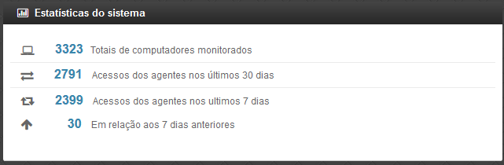

Pequeno módulo que fornece informações rápidas baseadas nos relatórios do sistema.

+ **Totais de computadores monitorados:** Mostra a quantidade de computadores que estão sendo monitoradas pelo sistema Cacic.

+ **Acesso dos agentes nos últimos 30 dias:** Mostra a quantidade de máquinas que se comunicaram com o Gerente Cacic nos últimos 30 dias

+ **Acesso dos agentes nos últimos 7 dias:** Mostra a quantidade de máquinas que se comunicaram com o Gerente Cacic nos últimos 7 dias

+ **Em relação aos 7 dias anteriores:** Diferença entre nas coletas entre a semana anterior e a semana atual

----

**Agentes**

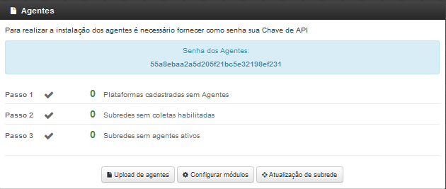

Ferramenta de acesso rápido para controle dos Agentes.

----
 
**Atalhos**

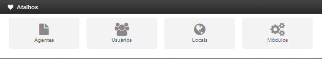

Mostram ícones para atalhos rápidos de algumas funcionalidades do sistema:

+ **Agentes:** Atalho para atualização de sub-redes.

+ **Usuários:** Atalho para cadastro de usuários. 

+ **Locais:** Atalho para cadastro de locais.

+ **Módulos:** Atalho para configuração de módulos.

----

**Boas vindas**

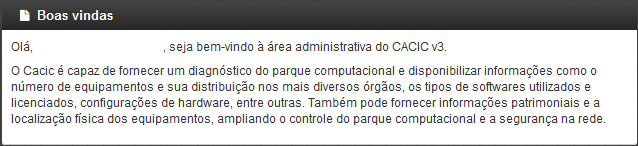

Exibe uma mensagem cordial ao usuário, informando a versão principal do sistema e uma descrição sobre o sistema.

----

**Computadores Monitorados por Sistema Operacional**

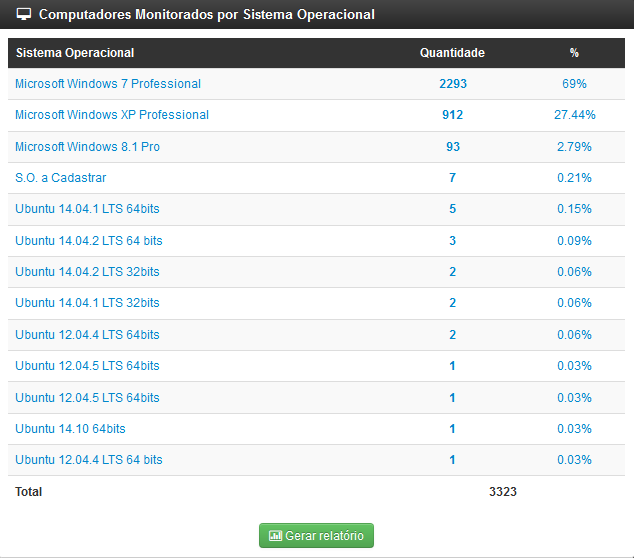

Exibe um relatório básico sobre os sistemas operacionais encontrados nos relatórios do Cacic.
 
---- 
 
Instalação dos Agentes
======================

 A instalação dos agentes nas máquinas ocorre de uma forma clara e intuitiva. Existem instaladores próprios tanto para o sistema Windows quanto para o GNU/Linux.

**Instalação em computadores Windows**

 Para instalação em ambiente Windows, basta baixar o arquivo “.msi” do repositório e execute o programa. 

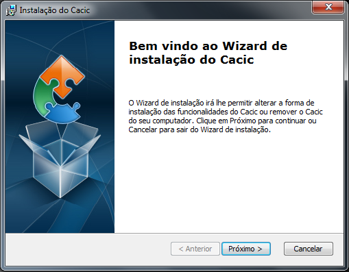

 Quando o instalador abrir, clique em “Próximo”.

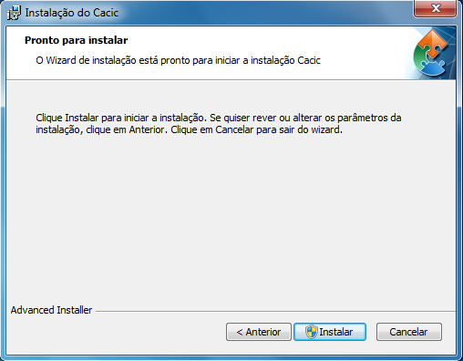

 Clique em “Instalar” para seguir com a instalação padrão.

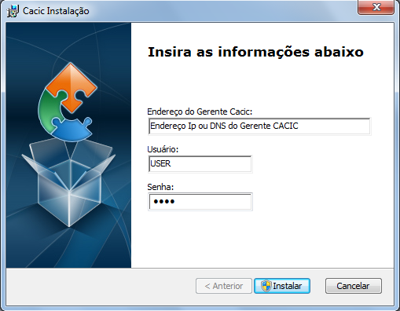

 Insira o endereço IP ou o DNS onde o Gerente Cacic se encontra, o usuário e a senha. Logo após, clique em “Instalar”.

 Caso a instalação tenha sido feita de forma padrão, conforme este manual e sem alterações, o usuário e senha são respectivamente “cacic” e “cacic123”.

 Para realizar a alteração desta chave de API entre como administrador do Gerente Cacic e acesse o menu “Meus Dados” (Barra de Título e Configurações Rápidas do Sistema → Meus Dados → Meus Dados, item 7.5.2 deste manual) e clicando no botão azul “Editar Dados” será aberta uma nova página para edição dos dados.

 Altere a chave de API e outros dados, caso queira corrigir e clique em “Salvar Dados”. Será solicitado a instalação de algumas dependências, como o OpenSSL, aceite todas.

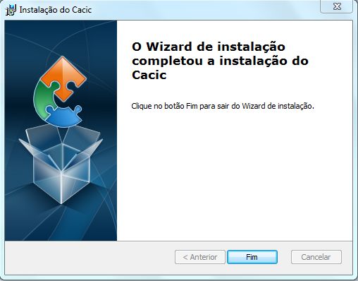

 Instalação realizada com sucesso.

 Instalação em computadores GNU/Linux

 Para instalação em ambiente GNU/Linux é necessário fazer o download do arquivo de instalação no repositório e executar o seguinte comando:

``Install-cacic -host=EnderecoDoGerente -user=usuário -pass=senha``

---- 

Verificação de Logs
===================

+ **Sistema Windows**

 Os arquivos de log no sistema Windows ficam em “C:\Cacic\Logs”.

**Arquivos de Logs:**

+ **cacic:** Este arquivo apresenta todas as atividades do Agente Cacic, como instalação, atualização e coletas.

 - **Instalação:** Quando o processo de instalação ocorre sem erros, o Agente reporta um log como este: (O conteúdo dos logs podem variar conforme a máquina, mas deve ser parecido com este)

``[13-05-2015 11:01:00.783] [Info] {Install Cacic} Inicio de instalacao``

``[13-05-2015 11:01:00.788] [Info] {Install Cacic} Realizando login...``

``[13-05-2015 11:01:02.277] [Info] {Install Cacic} Login realizado com sucesso!``

``[13-05-2015 11:01:03.524] [Info] {Install Cacic} Pegando informacoes do gerente...``

``[13-05-2015 11:01:04.275] [Info] {Install Cacic} Sucesso! Salvando configuracoes em arquivo...``

``[13-05-2015 11:01:04.285] [Info] {Install Cacic} Realizando download do servico...``

``[13-05-2015 11:01:04.306] [Info] {Install Cacic} Instalando servico.``

``[13-05-2015 11:01:04.313] [Info] {Cacic Daemon} Servico parado.``

``[13-05-2015 11:01:04.878] [Info] {Cacic Daemon} Cacic 3.1.11 iniciado.``

``[13-05-2015 11:01:05.878] [Info] {Install Cacic} Instalacao realizada com sucesso.``

 - **Coleta:** Quando o Agente realiza sua consulta, ele somente a envia para o gerente caso esta seja diferente da coleta já existente.

  - **Enviando coletas:**

``[10-05-2015 03:27:23.737] [Info] {Cacic Daemon (Thread)} Thread iniciada em: dom mai 10 03:27:23 2015``

``[10-05-2015 03:27:24.205] [Info] {Gercols} Iniciando coleta de hardware.``

``[10-05-2015 03:27:25.702] [Info] {Gercols} Coleta de hardware finalizada.``

``[10-05-2015 03:27:25.702] [Info] {Gercols} Iniciando coleta de software.``

``[10-05-2015 03:27:25.718] [Info] {Gercols} Coleta de software finalizada.``

``[10-05-2015 03:27:27.995] [Info] {Gercols} Novas informacoes prontas para o envio ao gerente.``

``[10-05-2015 03:27:28.073] [Info] {Cacic Daemon (Thread)} Thread finalizada com SUCESSO``

``[10-05-2015 03:27:28.073] [Info] {Cacic Daemon (Timer)} Enviando coleta ao gerente.``

``[10-05-2015 03:28:04.702] [Info] {Cacic Daemon (Timer)} Coleta enviada com sucesso.``

  - **Sem coletas para enviar:**

``[10-05-2015 04:25:48.206] [Info] {Cacic Daemon (Thread)} Thread iniciada em: dom mai 10 04:25:48 2015``

``[10-05-2015 04:25:48.564] [Info] {Gercols} Iniciando coleta de hardware.``

``[10-05-2015 04:25:49.906] [Info] {Gercols} Coleta de hardware finalizada.``

``[10-05-2015 04:25:49.906] [Info] {Gercols} Iniciando coleta de software.``

``[10-05-2015 04:25:49.922] [Info] {Gercols} Coleta de software finalizada.``

``[10-05-2015 04:25:51.856] [Info] {Gercols} Coleta sem alteracoes.``

``[10-05-2015 04:25:51.934] [Info] {Cacic Daemon (Thread)} Thread finalizada com SUCESSO``

``[10-05-2015 04:25:51.934] [Info] {Cacic Daemon (Timer)} Sem diferenca na coleta.``

 - **Atualização:** O Agente ao se comunicar com o Gerente, recebe informações sobre a última versão dos agentes no servidor, caso sua versão esteja desatualizada, o mesmo realizará sua atualização antes de efetuar o envio das coletas.

``[13-05-2015 11:58:33.163] [Info] {Cacic Daemon (Timer)} Realizando comunicacao em: 10.209.8.110/app_dev.php``

``[13-05-2015 11:58:37.905] [Info] {CheckModules} Atualizacao de gercols.exe necessaria.``

``[13-05-2015 11:58:37.949] [Info] {CheckModules} gercols.exe baixado com sucesso!``

``[13-05-2015 11:58:37.952] [Info] {CheckModules} Atualizacao de install-cacic.exe necessaria.``

``[13-05-2015 11:58:37.996] [Info] {CheckModules} install-cacic.exe baixado com sucesso!``

+ **cacic_error:** O Agente também informa quando algum erro ocorre. Alguns possíveis erros.

``[Error] {CheckModules} Problemas durante o download de cacic-service.exe``

``[Error] {CheckModules} O arquivo ja esta sendo usado por outro processo.``

``[Error] {CheckModules} Problemas durante o download de chksys.exe``

``[Error] {Cacic Daemon (Timer)} Problemas ao checkar modulos.``

``[Error] {CheckModules} O arquivo ja esta sendo usado por outro processo.``

``[Error] {CheckModules} Problemas durante o download de cacic-service.exe``

``[Error] {CheckModules} O arquivo ja esta sendo usado por outro processo.``

``[Error] {CheckModules} Problemas durante o download de chksys.exe``

``[Error] {Cacic Daemon (Timer)} Falha na coleta: Error downloading https://10.209.8.110/app_dev.php/ws/neo/coleta - server replied: Internal Server Error``

+ **SCRIPT_CACIC:** Quando o Agente é instalado via script, também é gerado um log.

``-----------------------------UPDATE CACIC-----------------------------``

``20/02/2015 - Conectando via Samba...``

``20/02/2015 - MSI encontrando, realizando instalação cacic 3.0...``

``20/02/2015 - Removendo conexão com a partição Samba...``

``20/02/2015 - Deletando vestigios de atualizacao...``

``20/02/2015 - Deletando pasta temporaria...``
