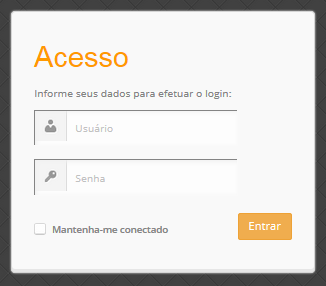

============================================
Abrindo a tela de login do Gerente Cacic 3.1
============================================

+ Abra o navegador e digite: 

http://localhost/cacic/

 Pressione "enter". 

+ Clique em app_dev.php 

 Entre com o usuário e a senha. 

Usuário: admin 

Senha: 123456 

Instalando e configurando o FTP (Debian) 
----------------------------------------

**Atenção:**

+ A instalação do FTP é OPCIONAL. Continue este passo da instalação conforme sua necessidade.

----

 Para que os Agentes consigam coletar, é necessário instalar e configurar um serviço de FTP. O procedimento abaixo deve ser executado como usuário root: 

``# apt-get install proftpd-basic``

 Quando perguntado, selecione o modo autônomo (standalone) para o servidor de FTP. Em seguida, abra o arquivo de configurações: 

``# vim /etc/proftpd/proftpd.conf``

 
+ Descomente as linhas abaixo: 
 
``# Use this to jail all users in their homes``
 
``DefaultRoot                           ~``
 
``# Users require a valid shell listed in /etc/shells to login.``
 
``# Use this directive to release that constrain.``
 
``RequireValidShell                    off``
 

 A versão do apache2 que foi publicado com o lançamento do Ubuntu 14.04 é o 2.4.7 e começando com esta versão, parece que, por razões de segurança, o novo diretório raiz para o servidor é:
 
``/var/www/html``

 Adicione um usuário que será usado pelo CACIC para download dos updates. No exemplo a seguir, adicionamos uma conta ftpcacic:

``# adduser --shell /bin/false --home /var/www/html/ftpcacic ftpcacic``

 Preencha a senha do usuário quando perguntado.
 
Observe que o HOME deste usuário é: ``/var/www/html/ftpcacic``

 Nesse mesmo diretório crie uma pasta “agentes” utilizando os comandos a seguir: 

``# mkdir /var/www/html/ftpcacic/agentes``

``# chown ftpcacic.ftpcacic /var/www/html/ftpcacic/agentes``

+ Teste a conexão. 

 Primeiro você deverá reiniciar o proftpd com o comando a seguir: 

``# /etc/init.d/proftpd restart``

----

**Execute depois os comandos a seguir para testar a conexão FTP:**

+ Windows: 

``C:\ftp ip_do_servidor_cacic``

login: ftpcacic

senha: senha_do_ftpcacic

ftp quit

+ Linux:

``$ telnet ip_do_servidor_cacic 21``

 Quando abrir a tela do telnet, digite os seguintes comandos:

user ftpcacic

pass senha_ftp

quit

**O FTP deve estar funcionando e conectando.**

`<-- Anterior <debian_ubuntu.rst>`_ <- - -> `Próximo --> <menu_principal.rst>`_