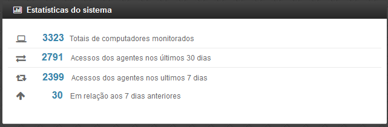
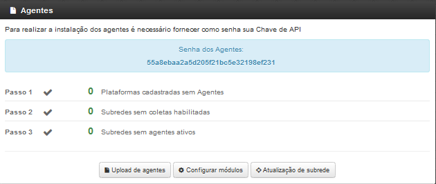
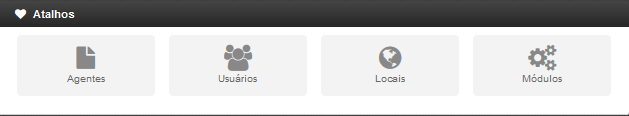
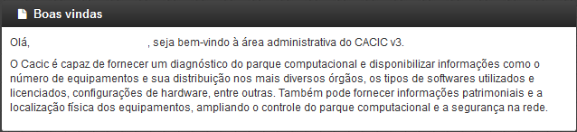

==================================================
Barra de Título e Configurações Rápidas do Sistema
==================================================

 Esta barra da página principal do Cacic é composta pelos seguintes elementos:

----

**Informação da versão atual do sistema.**

 Exibe a versão atual do sistema completa. Este item também possui um link que possibilita ao usuário retornar à página principal do Cacic de onde estiver.

----

**Notificações:**
 Exibe as notificações do sistema.

----

**Configurações:** Atalho rápido para configuração do sistema.

+ **Configurar Padrões:** Esta ferramenta possibilita a configuração do comportamento padrão dos Agentes. Estas configurações envolvem enviar erros aos usuários; exibir um ícone do Cacic na bandeja do sistema (systray); controle de tempos de execução inicial, coleta e coleta forçada dos agentes; senha para administração dos agentes e configurações gerais.

+ **Configurar Módulos:** Atalho para a ferramenta de configuração de módulos. Já mostrado no ítem “4.1.2 – Administração → Configurar Coletas → Habilitando módulos”.

----

**Meus Dados:** Atalho para configurações pessoais.

+ **Meus Dados:** Visualiza os dados do usuário do Cacic logado no sistema.

+ **Alterar Senha:** Permite ao usuário alterar sua senha do sistema.

+ **Sair:** Permite que o usuário realize uma saída segura do sistema.

+ **Logado como:** Informa o usuário que está utilizando o sistema.

====================================================
Barra de atalho para o Cacic e para o Software Cocar
====================================================

+ **Atalhos para a página principal do Cacic:** Em qualquer lugar que o usuário se encontrar na navegação do sistema, basta clicar no ícone do índio colorido ou no botão lateral direito, que será direcionado à página principal do sistema.

+ **Botões com notificação:** Existe também um botão de atalho para o software Cocar. Ambos os botões possuem um contador de notificações.

=======================
Estatísticas do Sistema
=======================

 Pequeno módulo que fornece informações rápidas baseadas nos relatórios do sistema.

+ **Totais de computadores monitorados:** Mostra a quantidade de computadores que estão sendo monitoradas pelo sistema Cacic.

+ **Acesso dos agentes nos últimos 30 dias:** Mostra a quantidade de máquinas que se comunicaram com o Gerente Cacic nos últimos 30 dias

+ **Acesso dos agentes nos últimos 7 dias:** Mostra a quantidade de máquinas que se comunicaram com o Gerente Cacic nos últimos 7 dias

+ **Em relação aos 7 dias anteriores:** Diferença entre nas coletas entre a semana anterior e a semana atual

=======
Agentes
=======

 Ferramenta de acesso rápido para controle dos Agentes.

=======
Atalhos 
=======

 Mostram ícones para atalhos rápidos de algumas funcionalidades do sistema:

+ **Agentes:** Atalho para atualização de sub-redes.

+ **Usuários:** Atalho para cadastro de usuários. 

+ **Locais:** Atalho para cadastro de locais.

+ **Módulos:** Atalho para configuração de módulos.

===========
Boas vindas 
===========

 Exibe uma mensagem cordial ao usuário, informando a versão principal do sistema e uma descrição sobre o sistema.

================================================
Computadores Monitorados por Sistema Operacional
================================================

.. image:: img/computadores_so.png

 Exibe um relatório básico sobre os sistemas operacionais encontrados nos relatórios do Cacic.